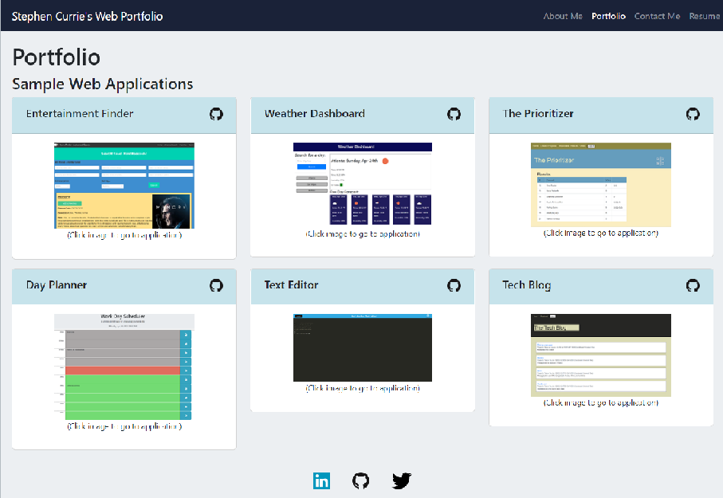

# Stephen Currie's Web Application Portfolio

## Description

This page is a web portfolio for Stephen Currie that is built using React.  The look and feel and content of this page will get updated periodically as new applications get built and/or when the page can be improved visually.

The app is running on a different github pages repo as I had to set up a new repo to get it to deploy to github pages.  But the source code is exactly the same.

Stephen can be reached directly at scurrie@gmail.com

## Table of Contents

- [Screenshots and Links](#screenshots)
- [Acceptance Criteria](#acceptance)
- [What I Learned](#learned)
- [Credits](#credits)

## ScreenShots

Below is a screen shot of the web application:

The page is live on [GitHub Pages](https://stephencurrie.github.io/my-new-portfolio/)

The code is in the [GitHub Repository](https://github.com/stephencurrie/my-portfolio)

## Acceptance

The following are things accomplished by this portfolio site:

- [x] When I load the portfolio, I am presented with a page containing a header, a section for content, and a footer
- [x] When I view the header, I am presented with the developer's name and navigation with titles corresponding to different sections of the portfolio
- [x] When I view the navigation titles, I am presented with the titles About Me, Portfolio, Contact, and Resume, and the title corresponding to the current section is highlighted
- [x] When I click on a navigation title, I am presented with the corresponding section below the navigation without the page reloading and that title is highlighted
- [x] When I load the portfolio the first time, the About Me title and section are selected by default
- [x] When I am presented with the About Me section, I see a recent photo or avatar of the developer and a short bio about them
- [x] When I am presented with the Portfolio section, I see titled images of six of the developer’s applications with links to both the deployed applications and the corresponding GitHub repositories
- [x] When I am presented with the Contact section, I see a contact form with fields for a name, an email address, and a message
- [x] When I enter text into the email address field, I receive a notification if I have entered an invalid email address
- [x] When I am presented with the Resume section, I see a link to a downloadable resume and a list of the developer’s proficiencies
- [x] When I view the footer, I am presented with text or icon links to the developer’s GitHub and LinkedIn profiles, and their profile on a third platform (Stack Overflow, Twitter)

## Learned

The following is a list of things I learned:

- How to use create React to build a single page web application in React
- How to use state to change a page based on user activity
- How to style a React web application
- How to deploy a React web application (I am still working on this)

## Credits

On the entertainment finder application, I worked with a team that included:
- Adam Brock - Javascript, Technical Manager
- Da Eun Kim - Javascript, Layout
- Harris Al - Javascript
- Ron Crawford - CSS, Javascript
- Stephen Currie - Layout, Project Manager

On the prioritizer application, I worked with a team that included:
- Andres Sierra
- Michael Schenck
- Misty Duhart
- Stephen Currie